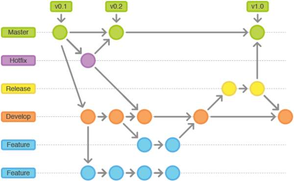

# 分支管理

几乎每一种版本控制系统都以某种形式支持分支。
使用分支意味着你可以从开发主线上分离开来，然后在不影响主线的同时继续工作。

有人把 Git 的分支模型称为"必杀技特性"，而正是因为它，将 Git 从版本控制系统家族里区分出来。



## 常用操作

```
git branch //查看分支
git branch <name> //创建分支
git checkout <name> //切换分支
git checkout -b <name> //创建+切换分支
git merge <name> //合并某分支到当前分支
git branch -d <name> //删除分支
```


当你执行 `git init` 的时候，缺省情况下 Git 就会为你创建`master`分支。

### 查看分支

```
git branch
```

```
git branch -a //查看本地和远程仓库的所有分支
```

```
git branch -r //查看远程仓库的分支
```


### 创建分支
```
git branch (branchname)
```

### 切换

```
git checkout (branchname)
```

> 当你切换分支的时候，Git 会用该分支的最后提交的快照替换你的工作目录的内容， 所以多个分支不需要多个目录。

当你以此方式在上次提交更新之后创建了新分支，如果后来又有更新提交， 然后又切换到了`testing`分支，Git 将还原你的工作目录到你创建分支时候的样子


接下来我们将演示如何切换分支，我们用 `git checkout (branch)` 切换到我们要修改的分支。
```
$ ls
README
```

```
$ echo 'w3cschool.cc' > test.txt
```

```
$ git add .
```

```
$ git commit -m 'add test.txt'
[master 048598f] add test.txt
 2 files changed, 1 insertion(+), 3 deletions(-)
 delete mode 100644 hello.php
 create mode 100644 test.txt
 ```
 
 ```
$ ls
README		test.txt
```

```
$ git checkout testing
Switched to branch 'testing'
```

```
$ ls
README		hello.php
```
当我们切换到`testing`分支的时候，
我们添加的新文件test.txt被移除了, 
原来被删除的文件hello.php文件又出现了。切换回`master`分支的时候，它们有重新出现了。
```
$ git checkout master
Switched to branch 'master'

$ ls
README		test.txt
```

我们也可以使用 `git checkout -b (branchname)`  命令来创建新分支并立即切换到该分支下，从而在该分支中操作。
```
$ git checkout -b newtest
Switched to a new branch 'newtest'

$ git rm test2.txt 
rm 'test2.txt'

$ ls
README		test.txt

$ git commit -am 'removed test2.txt'
[newtest 556f0a0] removed test2.txt
 1 file changed, 1 deletion(-)
 delete mode 100644 test2.txt
 
$ git checkout master
Switched to branch 'master'

$ ls
README		test.txt	test2.txt
```
如你所见，我们创建了一个分支，在该分支的上下文中移除了一些文件，然后切换回我们的主分支，那些文件又回来了。
使用分支将工作切分开来，从而让我们能够在不同上下文中做事，并来回切换。

### 合并分支

```
git merge
```
你可以多次合并到统一分支， 也可以选择在合并之后直接删除被并入的分支。

##### 放弃合并

```
git merge --abort
```

> git merge --abort 只能在合并导致冲突后运行。 git merge --abort 将中止合并过程并尝试重建预合并状态。 但是，如果在合并开始时有未提交的更改（特别是如果在合并开始后进一步修改了这些更改）， git merge --abort 在某些情况下将无法重建原始（合并前）更改。

### 合并冲突
合并并不仅仅是简单的文件添加、移除的操作，Git 也会合并修改。
```
$ git branch
* master
* 
$ cat test.txt
w3cschool.cc
```

### 删除分支

删除本地分支
```
git branch -d 分支名
```

删除一个名字为branchName的分支。如果该分支有提交未进行合并，则会删除失败。

```
git branch -D 分支名
```
强制删除一个名字为branchName 的分支。如果该分支有提交未进行合并，也会删除成功。


删除远程分支
```
git push origin -d 分支名
```

## 同步远程分支

查看远程分支：``git branch -a``

```
git fetch 将本地分支与远程保持同步
```

拉取远程分支并同时创建对应的本地分支
```
git checkout -b 本地分支名x origin/远程分支名
```

将本地所有分支与远程保持同步 
```
git fetch --all
```

最后拉取所有分支代码 
```
git pull --all
```

### 总结
