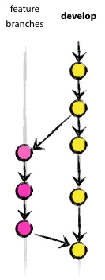

# 团队开发中git分支的使用


## 分支说明
* 主分支master
* 开发分支develop
* 功能分支（feature branch）
* 热修复补丁（hotfix branch）
* 预发分支（release branch）

前二种用于存放对外发布的版本，任何时候在这个分支拿到的，都是稳定的分布版；后者用于日常开发，存放最新的开发版。

后三种辅助分支，都是短期的，并且一半情况下只应该存在本地，不要提交到远程库一旦完成开发，它们就会被合并进develop或master，然后被删除。

在进行上面的分支时，建议的命名规范：feature-xxx、release-xxx、hotfix-xxx


##### 什么时候要功能分支？
当你拿到一个需求，或者不是一个立马需求上线的bug修复，那么就应该从 develop 开一个分支出来，完成这部分工作。完成后合并到 develop 分支。




##### 什么时候要预发分支？

这个分支是为预发准备的，测试的介入，也只应该在该分支产生时才介入。当我们不管是新功能开发，还是一般的bug修改都差不多了。就应该从develop产生一个release分支，交给测试，如果有bug直接在上面修改。全部完成后，合并回develop，并且合并到master。


关于这个分支我得再多说几句。因为这是非常重要的一步，如果我们使用了 git 钩子，当合并到 master 的时候，会自动发布到线上，所以这是临上线的最后一道屏障。

同时这里也解决了我一个疑惑，测试如何参与到git的每个分支中来？答案是：测试不应该参与到每个分支中来，只应该参与到release分支中去。其它的开发分支，都应该由开发人员自己测试，测试没有问题的时候才准许合并到develop，这就要求每一个开发要提高自己交付的产品质量，如何确保自己交付的产品质量？自动化测试是个不错的选择，好了，打住，这不是咋们今天的主要任务，这个话题改天再聊。


##### 什么时候需要补丁分支？

这种情况越少越好。因为它产生的原因是：线上出了bug，并且必须马上修复，不管你身在何方，当手机响起，拿出电脑改bug吧。

它与release 很像，都需要完成后，同时合并到:master与develop。不同的是，它需要从master 上开一个分支出来。


注意这里没有测试的介入，一半来说都是代码上某一个小的紧急bug，虽然很严重，但是可以很容易改动。当然如果有一些例外情况，应该让测试进行测试后再合并、发布。

总结
git 开发很好用，但是要按照一定规则合理使用分支。

另外，除了:master与develop 分支，其它分支都不应该出现在远程仓库中。

用git一定要结合它的各种钩子来使用，提升开发效率。这里后面来介绍下。


## 常用命令示例

```
git status                                  #隐藏当前工作区
git checkout master                  # 切换回master分支
git checkout -b hotfix master    # 新建hotfix分支，并切换到该分支
......                                       # 做一些bug修复工作
git checkout master                 # 切换回master分支
git merge --no-ff hotfix            # 合并hotfix分支，此时bug已被修复（无冲突）
git push origin master    # 推送master分支代码到远端
git stash pop                 #回到工作现场并删除stash内容
```

> –no-ff 用于保存之前的分支历史

##### Git分支常用命令
```
git checkout -b dev   #创建并切换分支
git branch                #查看当前分支
git merge dev          #合并分支
git branch -d dev    #删除分支
```


## 如何使用分支？

比如如说我们一个小组开发一个项目，如果每次小组成员把修改的代码都提交到主分支（master）上的话，那么其中某个成员一旦有了失误，跟其他成员代码之间发生了冲突，那么整个项目就不能正常运行了，这会严重干扰我们的进度，所以就需要去创建一个开发分支(development),把每次修改的代码都推送到开发分支上，那么就不会对主分支项目产生影响，更有利于组长合并代码，做容错处理，进行测试，当测试没有问题，就可以把开发分支（development）上的所有代码与主分支（master）进行合并推送到远程仓库就可以了！

### 工作流程

#### 一. 团队内部协作开发（分支）

1. 首先，项目经理 创建远程仓库
2. 创建项目（或者关联项目）

```
mkdir App //创建项目文件夹
cd App //进入文件夹
git init //初始化仓库
git add . 	//将工作区的文件添加到暂存区
git commit -m "a project" //将暂存区的代码提交到本地仓库
```
本地仓库此时已经有了我们的初始化项目，那么如何与远程仓库进行连接并推送呢？通过以下几个命令：
```
git remote -v //查看当前是否绑定远程仓库
git remote add 仓库别名 远程地址(例：git remote add origin https://gitee.com/qwe123/App.git)
// 这时候会发现 远程仓库里已经有了这个文件

```

3. 项目推送到远程仓库以后（团队开发成员）就可以把项目克隆到本地，进行开发

```
git clone 仓库地址 //克隆到本地
cd 文件夹路径  
git branch -v  //查看分支
git branch development(分支名)  //创建分支
git checkout development  //切换到development分支

//将写好的代码放到分支里
git add .  //将工作区代码提交到暂存区
git commit -m "add ele"  //将暂存区代码提交到本地仓库
```

4. 将本地仓库代码推送到远程仓库（团队开发成员）

```
git push 仓库别名 development(分支)
```
注意！！！！ 在提交到远程仓库的开发分支时，如果你没有权限，是没法进行提交的，不过在真正开发项目时，这些都是已经准备好的前提工作，让总监或项目经理给员工权限，成为开发者

5. 最后 合并代码（项目经理）

```
git clone 仓库地址 //克隆到本地（如果项目已有，直接git pull origin master将主分支拉下来）

//先在本地创建一个分支
git branch -v  //查看分支
git branch development  //创建分支
git checkout development  //切换分支
git pull origin development  //将开发者提交到远程仓库的分支拉下来
git checkout master  //切换到主分支进行合并
git merge development  //合并 

git add .
git commit -m "add some ele"
git push origin master  //推送到远程仓库
```

#### 二、远程跨团队协作开发（分支）

1. 项目经理创建远程仓库
2. 将项目仓库Fork到个人仓库（团队开发成员）
3. 将个人仓库克隆到本地（团队开发成员）

```
git clone 仓库地址
git branch development  //创建分支
git branch -v  //查看分支
git checkout development  //切换分支

//进行代码的编写与修改后
git add .
git commit -m "add some ele"
git push origin development 

//回到gitee官网
pull Request  //请求合并
```

4. 项目经理合并
5. 消息 --》 同意合并

## gitee


分支保护是为了防止相关成员推送代码到重要的分支（例如 master 分支），便于仓库的分支管理，点击前往保护分支规则设置。
常规分支：仓库成员（开发者权限及以上）可推送分支
保护分支：可自定义保护策略，默认仓库管理员才能管理（推送）被保护的分支
只读分支：任何人都无法推送代码（包括管理员和所有者），需要推送代码时应设为“常规”或“保护”分支